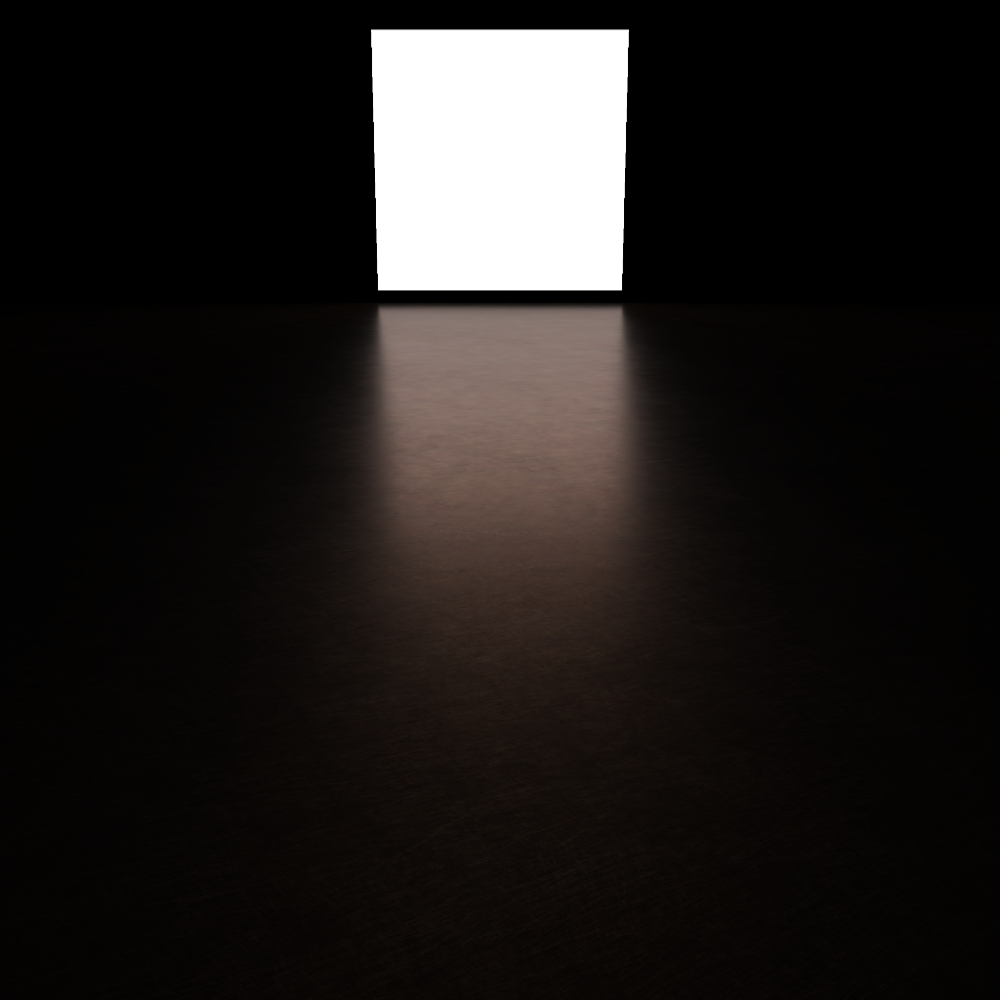
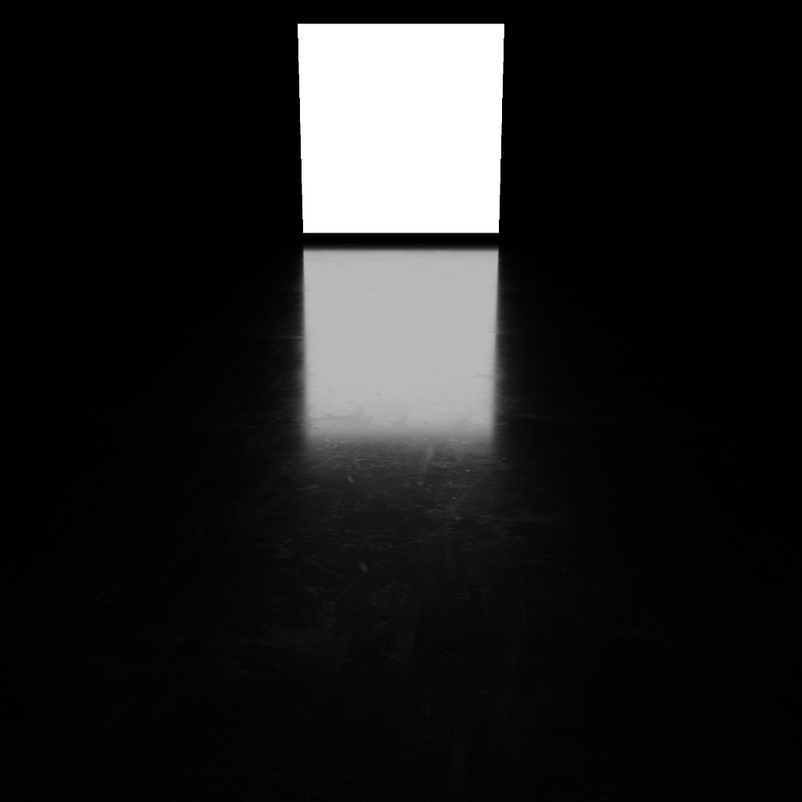
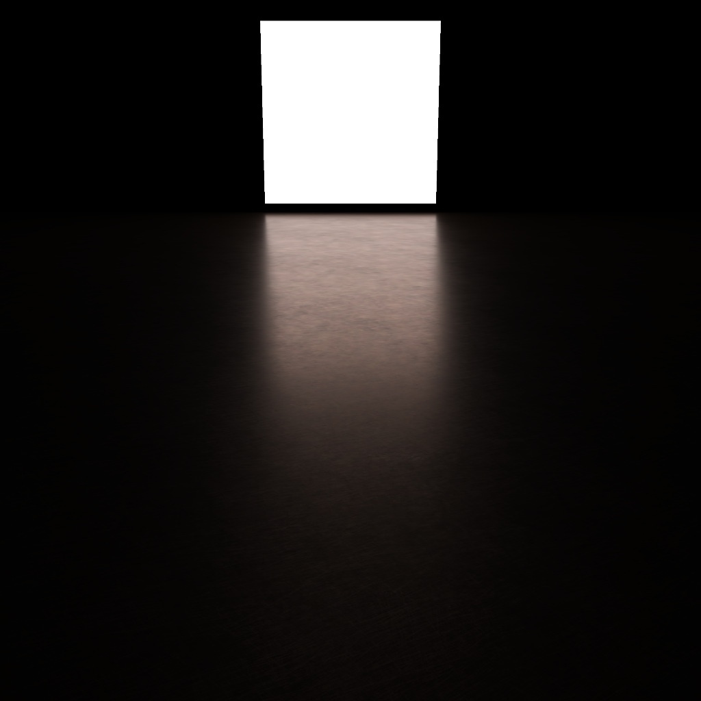
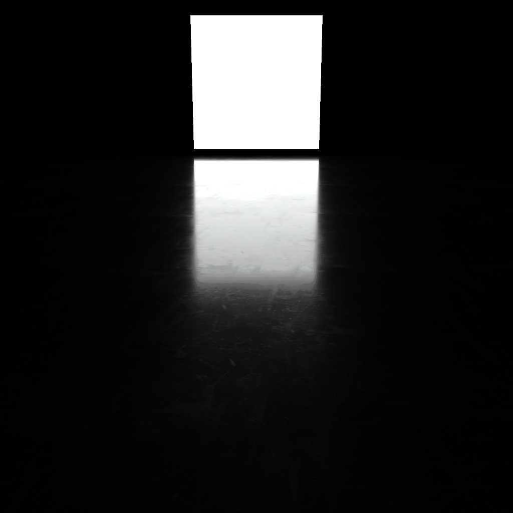
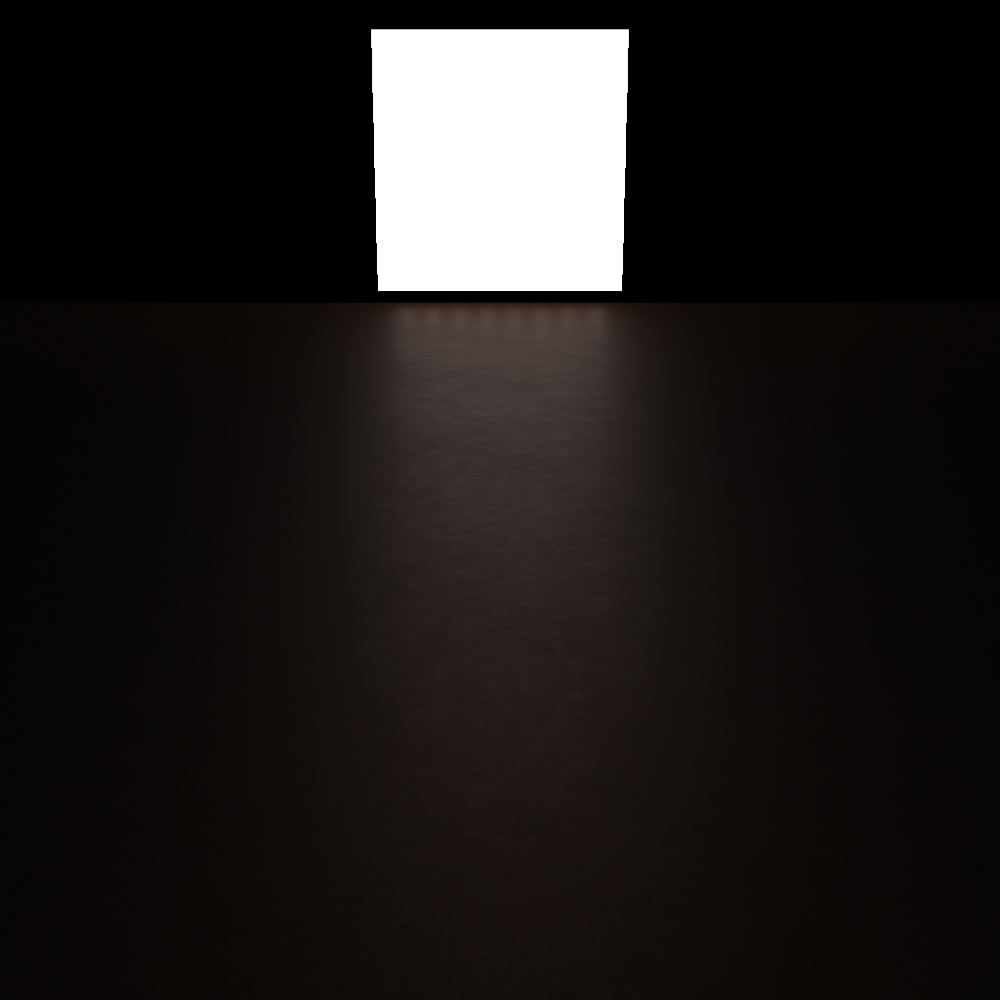
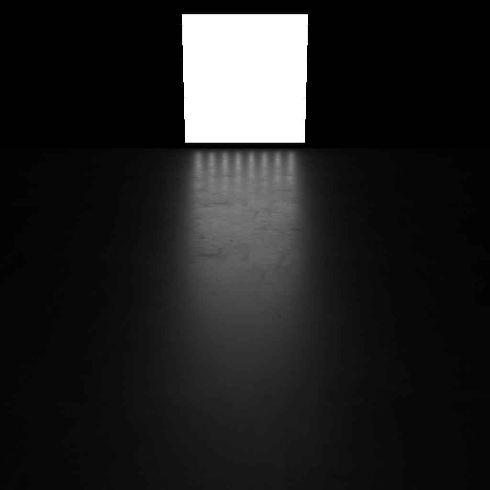

# Arealights

This application is part of Master's thesis about arealights methods in
real-time.

This project implements and compares three methods of implementing area lights:

* native point light cluster
* slow, but accurate Monte-Carlo method
* linearly transformed cosines with custom fitter which can be found in [sienkiewiczkm/ltc_fitter](https://github.com/sienkiewiczkm/ltc_fitter) repository

Thesis text (in Polish) can be found in [sienkiewiczkm/arealights-thesis](https://github.com/sienkiewiczkm/arealights-thesis) sienkiewiczkm/arealights-thesis repository.

## Screenshots

|   | Polished copper | Scuffed iron |
|---|---|---|
| LTC  |  |  |
| Monte Carlo |  |  |
| Point lights |  | 

Must read reference: Real-Time Polygonal-Light Shading with Linearly Transformed Cosines.
Eric Heitz, Jonathan Dupuy, Stephen Hill and David Neubelt.
ACM Transactions on Graphics (Proceedings of ACM SIGGRAPH 2016) 35(4), 2016.
Project page: https://eheitzresearch.wordpress.com/415-2/
